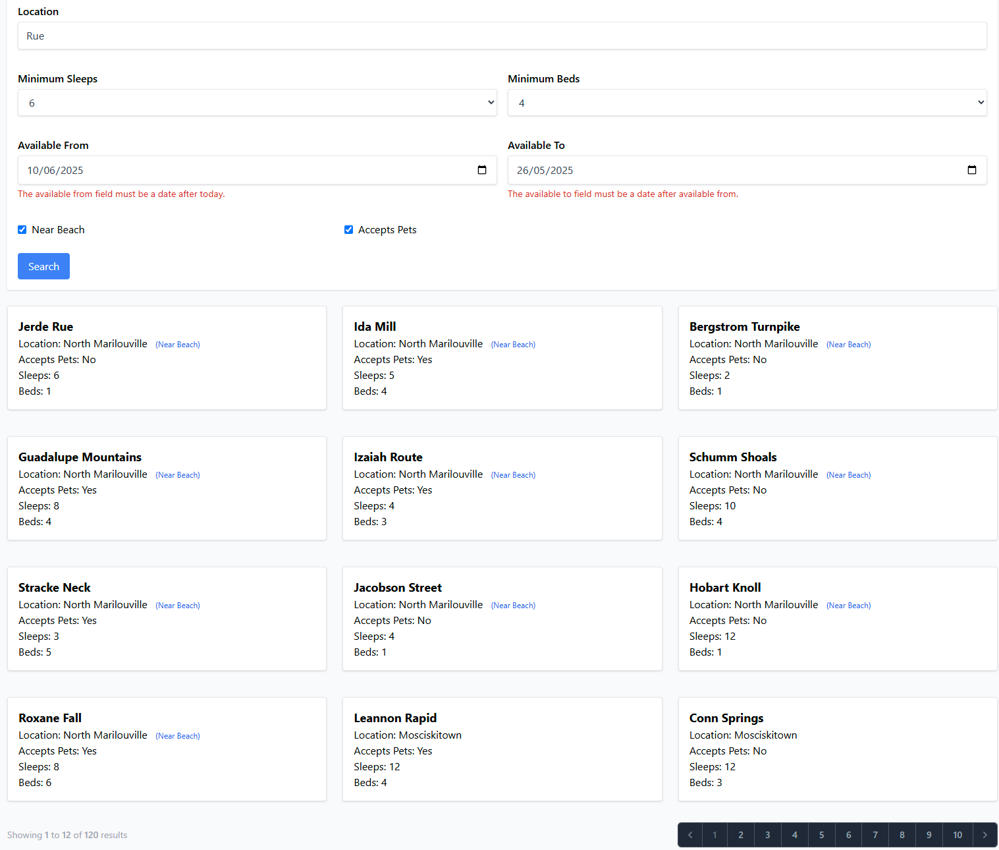
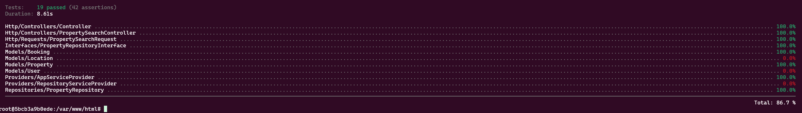

<p align="center"><a href="https://laravel.com" target="_blank"></a></p>

<p align="center">
<a href="https://github.com/laravel/framework/actions"></a>
<a href="https://packagist.org/packages/laravel/framework"></a>
<a href="https://packagist.org/packages/laravel/framework"></a>
<a href="https://packagist.org/packages/laravel/framework"></a>
</p>

## Application Boot
```
cd forge-properties
```
```
cp .env.example .env
```
```
docker-compose up -d
```
```
docker-compose exec app composer install
```
```
docker-compose exec app php artisan key:generate
```
```
docker-compose exec app npm install
```
```
docker-compose exec app npm run build
```
```
docker-compose exec app php artisan migrate:fresh --seed
```
## UI
```
http://127.0.0.1/
```

## Testing
```
docker-compose exec -it app bash
```
```
XDEBUG_MODE=coverage php artisan test --coverage
```

## Bookings Testing Scenarios
| Booking From | Booking To | `available_from` | `available_to` | Expected? | 
|--------------|------------|------------------|----------------|-----------|
| 2025-07-01   | 2025-07-10 | 2025-07-05       | *null*         | ❌ No     |
| 2025-07-01   | 2025-07-10 | *null*           | 2025-07-07     | ❌ No     |
| 2025-07-01   | 2025-07-10 | 2025-07-05       | 2025-07-06     | ❌ No     | 
| 2025-07-01   | 2025-07-10 | 2025-07-01       | 2025-07-10     | ❌ No     | 
| 2025-07-01   | 2025-07-10 | 2025-07-05       | 2025-07-15     | ❌ No     | 
| 2025-07-01   | 2025-07-10 | *null*           | 2025-07-01     | ❌ No     |
| 2025-07-01   | 2025-07-10 | *null*           | 2025-07-10     | ❌ No     |
| 2025-07-01   | 2025-07-10 | 2025-07-01       | *null*         | ❌ No     |
| 2025-07-01   | 2025-07-10 | 2025-07-10       | *null*         | ❌ No     |
| 2025-07-01   | 2025-07-10 | 2025-06-30       | 2025-07-05     | ❌ No     | 
| 2025-07-01   | 2025-07-10 | *null*           | 2025-07-11     | ✅ Yes    | 
| 2025-07-01   | 2025-07-10 | *null*           | 2025-06-31     | ✅ Yes    |
| 2025-07-01   | 2025-07-10 | 2025-07-11       | *null*         | ✅ Yes    |
| 2025-07-01   | 2025-07-10 | 2025-06-31       | *null*         | ✅ Yes    | 
| 2025-07-01   | 2025-07-10 | 2025-07-11       | 2025-07-12     | ✅ Yes    |
| 2025-07-01   | 2025-07-10 | 2025-06-30       | 2025-06-31     | ✅ Yes    |
| -            | -          | 2025-07-01       | *null*         | ✅ Yes    |
| -            | -          | *null*           | 2025-07-10     | ✅ Yes    |
| -            | -          | 2025-07-01       | 2025-07-10     | ✅ Yes    |
| -            | -          | *null*           | *null*         | ✅ Yes    | 
